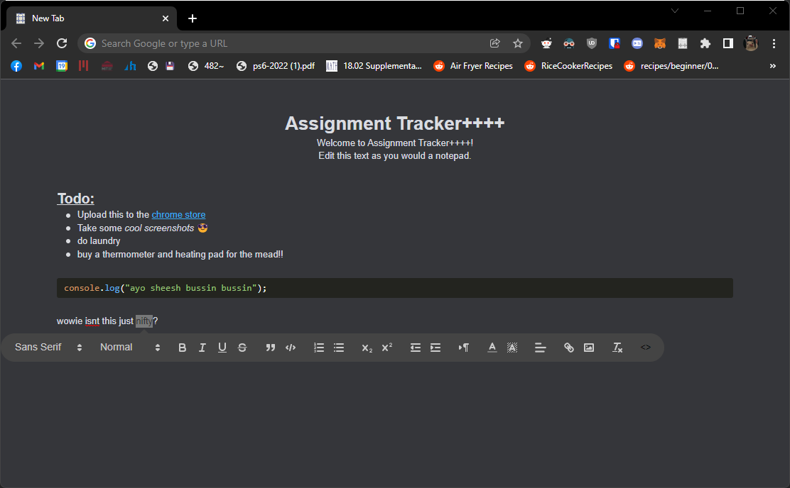

# Assignment Tracker++++

A rewrite of the chrome plugin [Assignment Tracker++](https://github.com/nataliesstewart/assignment-tracker) by [Natalie Stewart](https://github.com/nataliesstewart), adding a rich-text WYSIWYG editor for markdown, syntax highlighting, links, images, etc. 

## Installation

The extension can be downloaded from the [chrome store](https://chrome.google.com/webstore/detail/assignment-tracker%20%20%20%20/oalpfcadjkoogenomjfheofngijfjncp?hl=en)
Alternatively, to install directly from this repo, do the following:

### Chrome
* clone or download the repo.
* follow [these instructions](https://webkul.com/blog/how-to-install-the-unpacked-extension-in-chrome/) to install unpacked from the cloned repo.

## Current state:

* Foreground color, background color are able to be configured in `chrome://extensions` within chrome
* Supports text size, margins, links, images, custom fonts, text alignment, lists, and other text formatting options
* Adds a context menu to quickly copy links or texts to your new tab page
* Supports code syntax highlighting via [hightlight.js](https://highlightjs.org/)